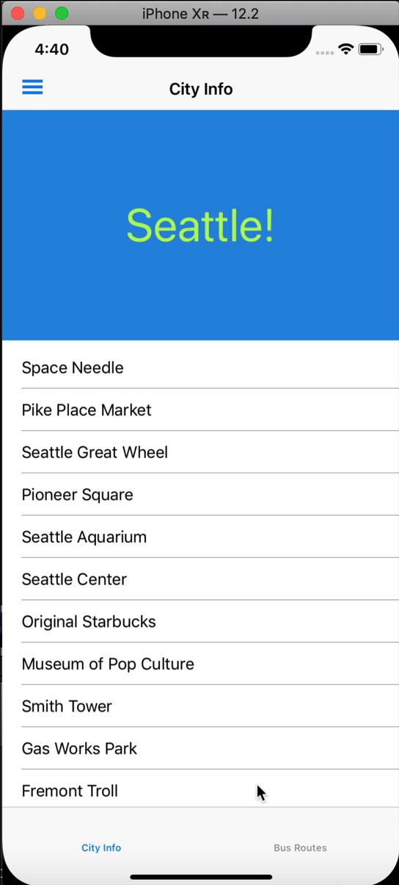

# Xamarin.Forms Shell Demo

Part of the reason I love Xamarin.Forms so much is that it provides a way to create [beautiful native UIs](https://docs.microsoft.com/xamarin/xamarin-forms/user-interface/?WT.mc_id=shelloverview-github-masoucou) from a single code base.

[Xamarin.Forms 4.0](https://devblogs.microsoft.com/xamarin/introducing-xamarin-forms-4-0-the-era-of-shell/?WT.mc_id=shelloverview-github-masoucou) has upped that game by introducing [Shell](https://docs.microsoft.com/xamarin/xamarin-forms/app-fundamentals/shell/introduction?WT.mc_id=shelloverview-github-masoucou).

Much like Xamarin.Forms abstracts away user interface elements into an easy to use API, Shell abstracts away app architecture complexity.

Shell provides a container for your app. That container includes a `MasterDetailPage`, a `TabbedPage`, and a `NavigationPage` or a combination thereof.

This repo aims to show you how to make the most use of Shell so you can get it integrated into your apps in no time!

Here's the app that we'll be building!

## Flyout

While you wait for me to get the narrative together, [checkout the docs here](https://docs.microsoft.com/xamarin/xamarin-forms/app-fundamentals/shell/flyout?WT.mc_id=shelloverview-github-masoucou).

## Tabs

While you wait for me to get the narrative together, [checkout the docs here](https://docs.microsoft.com/xamarin/xamarin-forms/app-fundamentals/shell/tabs?WT.mc_id=shelloverview-github-masoucou).

## Navigation

While you wait for me to get the narrative together, [checkout the docs here](https://docs.microsoft.com/xamarin/xamarin-forms/app-fundamentals/shell/navigation?WT.mc_id=shelloverview-github-masoucou).

## And More!
